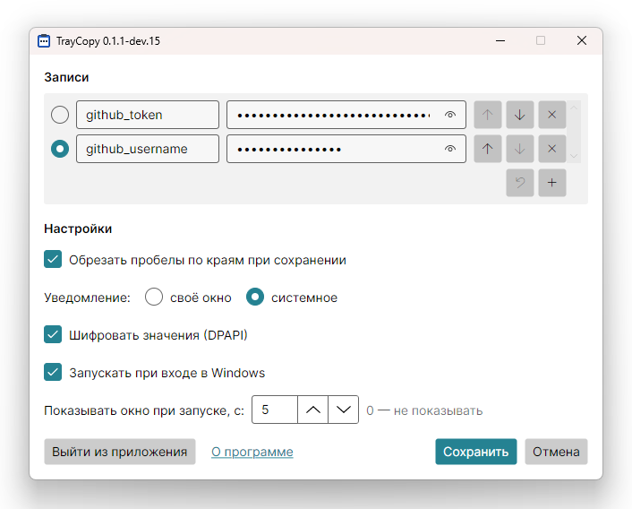

#  TrayCopy

Утилита для Windows, которая живёт в трее и копирует в буфер обмена заранее заданные
строки: клик по иконке — текущая строка в буфере, правый клик — выбрана следующая.
Удобно для токенов и других строк, которые часто вставляют в терминал.

## Установка

Установщики лежат в
[Releases](https://github.com/andrey-aka-skif/AndreyAkaSkif.TrayCopy/releases). Нужны
Windows 10 или 11 (x64). Приложение ставится для текущего пользователя в
`%LocalAppData%\Programs\TrayCopy`, права администратора не нужны.

| Установщик | Размер | Что нужно в системе |
|---|---|---|
| `TrayCopy-X.Y.Z-setup.exe` | около 33 МБ | ничего: среда .NET входит в установщик |
| `TrayCopy-X.Y.Z-setup-framework-dependent.exe` | около 10 МБ | среда .NET 10 (x64) |

Если не знаете, какой выбрать, берите первый. Второй подходит тем, у кого уже стоит
[.NET Runtime 10](https://dotnet.microsoft.com/download/dotnet/10.0) — отдельно или в
составе .NET Desktop Runtime или .NET SDK. Такую среду обновляет Microsoft Update, а
среда внутри первого установщика обновляется только с новой версией TrayCopy. Если среды
нет, второй установщик сообщит об этом и предложит открыть страницу загрузки .NET; сама
среда ставится с правами администратора. Варианты взаимозаменяемы: любой ставится
поверх другого.

Установщик не подписан, поэтому SmartScreen может предупредить о неизвестном издателе:
«Подробнее» → «Выполнить в любом случае».

## Использование

| Действие | Что происходит |
|---|---|
| Клик по иконке | текущая запись копируется в буфер обмена |
| Правый клик | текущей становится следующая запись |
| Клик с Shift | открывается окно настроек |

Копирование и выбор подтверждаются уведомлением, подсказка иконки показывает текущую
запись. Пока записей нет, любой клик открывает окно настроек. Окно открывается и
повторным запуском — например, ярлыком TrayCopy в «Пуске».

В окне настроек задаются записи «имя → значение» и текущая запись, вид уведомления,
шифрование значений и запуск при входе в Windows. Там же кнопка «Выйти из приложения»: другого способа
закрыть приложение нет. Рядом с ней ссылка «О программе»: версия, лицензия и сторонние
компоненты.

Windows 11 прячет новые иконки в область «^» рядом с часами. Чтобы иконка была всегда на
виду, перетащите её оттуда на панель задач или включите TrayCopy в «Параметры» →
«Персонализация» → «Панель задач» → «Другие значки в области уведомлений».

## Безопасность

- Значения по умолчанию зашифрованы DPAPI: расшифровать файл настроек может только тот
  же пользователь Windows на том же компьютере. Шифрование отключается в окне настроек.
- Скопированное значение не попадает в журнал буфера обмена (Win+V), в облачный буфер и
  в сторонние менеджеры буфера, которые учитывают формат `Clipboard Viewer Ignore`.

Настройки хранятся в `%APPDATA%\AndreyAkaSkif.TrayCopy\settings.json`.

## Удаление

Через «Параметры» → «Приложения» → «Установленные приложения». Запуск при входе в
Windows снимается, а файл настроек остаётся — чтобы удалить и его, удалите папку
`%APPDATA%\AndreyAkaSkif.TrayCopy`.
